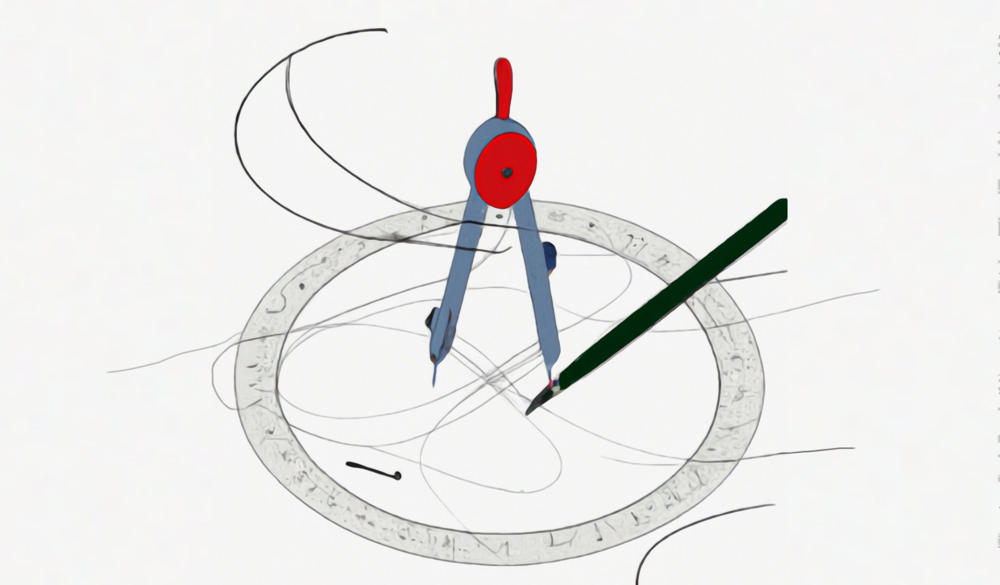
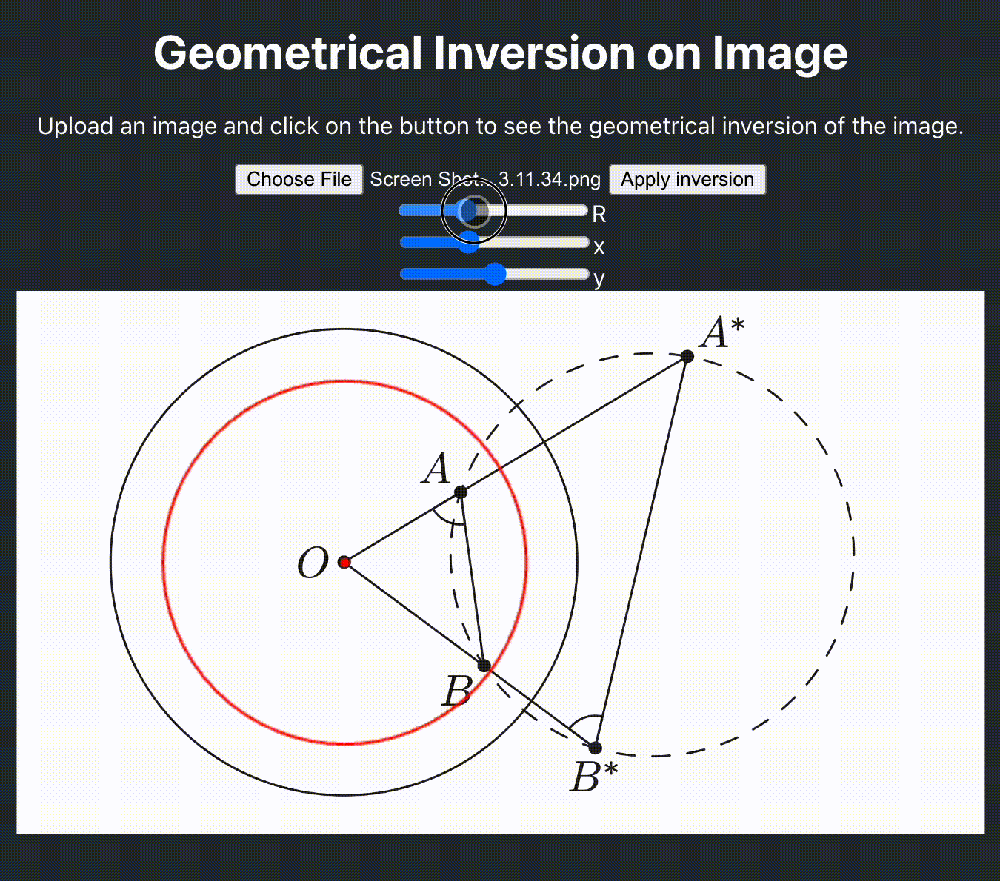

# Inversive Geometry



Interactive webapp that transforms images using geometric inversion.

## What's this about

Geometrical inversion maps every point P to a point P' such that OP × OP' = R², where O is the center and R is the radius of inversion. Feed it an image and watch it warp in real time.

Back in high school I built something like this, but it only worked through the terminal and I lost the code. So I remade it as a proper webapp with React. Along the way I came up with a neat optimization — instead of averaging mapped pixel colors with a regular mean, I used root mean square, which is [how pixel colors should actually be added](https://www.youtube.com/watch?v=LKnqECcg6Gw).

A few things you'll notice:
- Points inside the circle get mapped outside, and vice versa
- The image pixelates quickly near the center — multiple outer pixels collapse into one inner pixel
- Some spots have missing pixels — those got mapped outside the image boundaries



## How to launch

```bash
npm install
npm start
```

Opens on `localhost:3000`. Production build goes to `./docs`.

## Demo

[nomomon.github.io/inversive-geometry](https://nomomon.github.io/inversive-geometry/)
